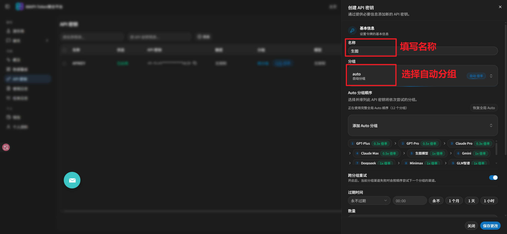

# 88API-Nano-Banana

来自 [88api.ai](https://88api.ai/) Token 聚合站的 Codex 专用 Gemini 生图插件。它通过 **OpenAI Chat Completions** 协议生成和编辑图片，并将结果直接保存到本地。

插件集成两款图片模型：

| 模型 | 定位 | 适合场景 |
| --- | --- | --- |
| `gemini-3.1-flash-image`（默认） | 速度与效率优先 | 日常文生图、快速迭代、常规参考图编辑 |
| `gemini-3-pro-image` | 细节与复杂任务优先 | 高细节画面、复杂构图、精细文字排版、复杂参考图编辑 |

普通任务会直接使用 Flash。用户明确要求高细节、最高质量、复杂构图、精细排版或复杂参考图编辑，但没有指定模型时，插件会在请求 API 前询问是否切换到 Pro；只有确认后才会使用 Pro。单次选择不会改写以后任务的默认模型。

插件独立于 `88API-Image-Gen`，不共享 Key 或配置文件。

## 选择适合你的方式

| 方式 | 适合场景 | 入口 |
| --- | --- | --- |
| Codex 插件（本项目） | 在 Codex 中用自然语言生成或编辑图片，适合参考图、重复任务、自动化和本地落盘 | <https://github.com/blackdm666/88api-Nano-Banana> |
| 简单生图工具 | 无需安装，在浏览器中填写提示词、调整参数、上传参考图并复用历史任务 | <https://img.88api.ai/> |
| 专业画布工具 | 适合复杂创作流程、图像与视频项目、提示词库、资产管理和 Agent 辅助任务 | <https://img-pro.88api.ai/> |

只想快速出一张图时使用简单生图工具；需要可视化管理素材和多步骤创作时使用专业画布；希望让 Codex 理解需求并自动执行、保存文件时使用本插件。

## API 协议

从 `v1.3.0` 开始，插件仅使用 OpenAI Chat Completions 协议：

| 场景 | 端点 | 请求格式 |
| --- | --- | --- |
| 文生图 | `https://88api.ai/v1/chat/completions` | JSON，`messages` 使用文本内容 |
| 参考图编辑 | `https://88api.ai/v1/chat/completions` | JSON，`messages` 使用文本与 `image_url` 内容块 |

请求使用 `Authorization: Bearer <KEY>` 和 `Content-Type: application/json`。

核心请求格式：

```json
{
  "model": "gemini-3.1-flash-image",
  "messages": [
    {
      "role": "user",
      "content": "生成一张图片：纯白背景，中央只有一个蓝色圆形，不要文字。"
    }
  ],
  "modalities": ["text", "image"],
  "extra_body": {
    "google": {
      "image_config": {
        "aspect_ratio": "16:9",
        "image_size": "4K"
      }
    }
  }
}
```

- `aspect_ratio` 支持 `1:1`、`2:3`、`3:2`、`3:4`、`4:3`、`4:5`、`5:4`、`9:16`、`16:9`、`21:9`。
- `image_size` 支持 `1K`、`2K`、`4K`。
- 参考图会按输入顺序转换成 `image_url` Data URI，与文字一起放入同一条用户消息。
- Pro 等长任务使用原始 HTTPS/1.1、`Accept-Encoding: identity`、10 分钟超时和每 15 秒本地心跳，避免高层 `fetch` 解码或无输出等待导致连接提前中断。Gemini 图片渠道不启用 `stream: true`。

## 环境

- Codex 插件功能
- Node.js 18 或更高版本
- 能通过 OpenAI Chat Completions 调用上述 Gemini 图片模型的 88api.ai Key

## 创建并配置 88API Key

### 1. 注册账号

打开 [88api.ai](https://88api.ai/) 注册账号并登录。

### 2. 创建 API Key

进入“API 密钥”，点击“创建 API 密钥”。名称可以自定义（例如“生图”），分组选择 `auto`（自动分组）；如需在当前分组渠道失败时继续尝试下一分组，可开启“跨分组重试”。



### 3. 复制 Key

复制创建好的完整 Key。


### 4. 让 Codex 自动安装并配置（推荐）

不会手动配置时，复制下面整个提示词到一个新的 Codex 任务中，再把 `<把刚复制的完整 Key 粘贴在这里>` 替换为自己的 Key。Codex 会完成安装、配置和非付费验证。

```text
请帮我安装并配置最新版 88API-Nano-Banana 插件。

插件仓库：
https://github.com/blackdm666/88api-Nano-Banana

88API Key：
<把刚复制的完整 Key 粘贴在这里>

请严格按照以下要求执行：
1. 使用 Codex 标准插件流程，从上面的 GitHub 仓库添加或更新 marketplace，再安装或更新 88api-nano-banana@88api-nano-banana，不要安装同名的其他来源。
2. 使用插件自带的 scripts/generate.mjs，通过 --set-key 将 Key 保存到插件专用配置文件；除非我明确要求保留其他设置，再通过 --set-model gemini-3.1-flash-image 确保 Flash 是当前保存的默认模型。
3. 不要在回复、命令输出、日志或项目文件中完整显示 Key，只允许显示脱敏预览。
4. 配置后运行 --get-config 和 --list-models，确认 Key 已配置，协议为 OpenAI Chat Completions，端点为 https://88api.ai/v1/chat/completions，当前保存模型和出厂默认模型均为 gemini-3.1-flash-image，并确认同时支持 gemini-3-pro-image。
5. 运行 node --check、--self-test 和一次 --dry-run。不要调用付费生图接口。
6. 运行 codex plugin list --json，确认插件状态为 installed、enabled。
7. 最后告诉我安装版本、配置文件路径和每项验证结果，并提醒我新建 Codex 任务，输入 @ 后从列表选择 88API-Nano-Banana 调用插件。
```

只把 Key 粘贴到自己的 Codex 任务中，不要发布到 GitHub Issue、公开聊天、仓库文件或截图里。

### 5. 手动配置

已经安装插件的用户也可以直接执行：

```powershell
node "<PLUGIN_ROOT>\scripts\generate.mjs" --set-key "<YOUR_88API_GEMINI_IMAGE_KEY>"
node "<PLUGIN_ROOT>\scripts\generate.mjs" --get-config
```

配置保存在 `~/.codex/88api-nano-banana-config.json`。不要把真实 Key 写入仓库、文档、日志或公开聊天内容。

## 安装

首次安装使用 Codex 标准 marketplace 流程：

```powershell
codex plugin marketplace add blackdm666/88api-Nano-Banana
codex plugin add 88api-nano-banana@88api-nano-banana
codex plugin list --json
```

已添加过该 marketplace 时，先刷新仓库快照，再重新安装插件版本：

```powershell
codex plugin marketplace upgrade 88api-nano-banana
codex plugin add 88api-nano-banana@88api-nano-banana
codex plugin list --json
```

`plugin list` 中应显示 `88api-nano-banana` 已安装并启用。安装或升级后必须新建 Codex 任务，使插件和技能列表重新加载。

## 在 Codex 中通过 @ 调用

在新任务的输入框中输入 `@`，从菜单中选择 **88API-Nano-Banana**，然后继续写自然语言需求。例如：

```text
@88API-Nano-Banana 生成一张 16:9 的科技产品海报，4K。
```

如果 `@` 菜单里没有出现插件，依次确认：

1. `codex plugin list --json` 中插件是 `installed`、`enabled`。
2. marketplace 已通过 `codex plugin marketplace upgrade 88api-nano-banana` 刷新。
3. 安装或升级后已经新建任务，而不是继续使用升级前打开的旧任务。

## 使用

不指定 `--model` 时使用保存的默认模型；首次安装的默认值是 `gemini-3.1-flash-image`。一次任务需要 Pro 时传入 `--model gemini-3-pro-image`，只有明确要求改变长期默认时才使用 `--set-model`。

文生图：

```powershell
node "<PLUGIN_ROOT>\scripts\generate.mjs" --prompt "在太空中挥手的布偶猫，背景是地球" --aspect 16:9 --resolution 1K
```

参考图编辑：

```powershell
node "<PLUGIN_ROOT>\scripts\generate.mjs" --model gemini-3-pro-image --image "<参考图.png>" --prompt "保持主体身份，改成电影海报" --aspect 9:16 --resolution 2K
```

比例和分辨率是请求目标，不是本地强制缩放。对尺寸有硬性要求时应检查最终文件；88API 或上游模型可能调整输出尺寸。

## 超长文本图片解析

正常响应从 Chat Completions 的消息内容或图片字段中读取图片。如果 88API 把图片包装在百万字符级 Markdown/Data URI 文本中，插件仍会在 128 MB 响应上限内：

- 解析 Markdown/Data URI 和 URL-safe Base64；
- 从摘要和错误中移除 Base64；
- 多个文本候选仅保留最后一张成品图；
- 对最终图片进行内容哈希去重。

## 安全测试

以下命令不会请求付费 API：

```powershell
node --check "<PLUGIN_ROOT>\scripts\generate.mjs"
node "<PLUGIN_ROOT>\scripts\generate.mjs" --self-test
node "<PLUGIN_ROOT>\scripts\generate.mjs" --prompt "测试" --dry-run
node "<PLUGIN_ROOT>\scripts\generate.mjs" --image "<参考图.png>" --prompt "测试编辑" --dry-run
```

每个 `--count` 都是独立云端请求。本地卡死、Codex 崩溃、断网或图片未保存，不代表云端任务取消；已经受理或完成的请求仍可能计费。`[NO-AUTO-RETRY]` 只禁止插件自动重发；用户了解风险后明确说“重试/重新生成/再试一次”，Codex 应直接提交 1 次新请求，不强制先查使用日志。
